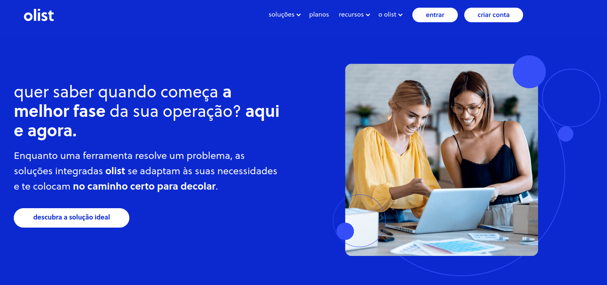

# P5_e-commerce_customers_clustering

# <a name="C1">Presentation</a>

I am a consultant for Olist, a Brazilian company that offers a solution for selling on online marketplaces.
***

<strong> olist homepage </strong>

***
### The Need for Olist

Olist wants me to provide its e-commerce teams with __customer segmentation__ that they can use daily for their communication campaigns.

My objective is to __understand the different types of users__ through their behavior and personal data.

I need to provide __the marketing team with an actionable description__ of my segmentation and its underlying logic for optimal use, as well as __a maintenance contract proposal__ based on an analysis of the stability of the segments over time.

### My mission

> My mission is to help Olist's teams understand the different types of users. Therefore, I will use __unsupervised methods to group customers with similar profiles__. These categories can be used by the Marketing team for better communication.

1. I will create an exploratory analysis notebook.
   
1. I will create a segmentation notebook:

   -The proposed segmentation must be actionable and easy to use by the Marketing team.
   -It must, at a minimum, differentiate between good and less good customers in terms of orders and satisfaction.
   -The segmentation must cover all customers.
   
1. Subsequently, once the segmentation model is chosen, Olist would like me to recommend the frequency at which the segmentation should be updated to remain relevant, in order to draft a maintenance contract.
   
1. For your information, the provided code must comply with the __PEP8__ convention to be usable by Olist.
